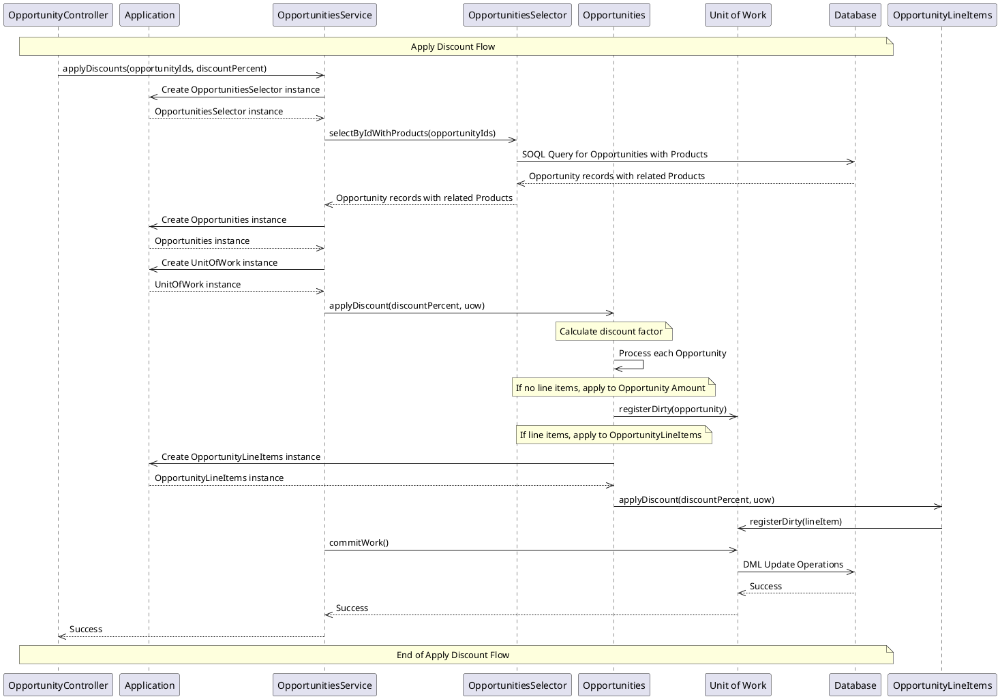

```plantuml
@startuml
    participant Controller as "OpportunityController"
    participant App as "Application"
    participant Service as "OpportunitiesService"
    participant Selector as "OpportunitiesSelector"
    participant Domain as "Opportunities"
    participant UOW as "Unit of Work"
    participant DB as "Database"

    Note over Controller,DB: Apply Discount Flow

    Controller ->> Service: applyDiscounts(opportunityIds, discountPercent)
    Service ->> App: Create OpportunitiesSelector instance
    App -->> Service: OpportunitiesSelector instance
    Service ->> Selector: selectByIdWithProducts(opportunityIds)
    
    Selector ->> DB: SOQL Query for Opportunities with Products
    DB -->> Selector: Opportunity records with related Products
    Selector -->> Service: Opportunity records with related Products
    
    Service ->> App: Create Opportunities instance
    App -->> Service: Opportunities instance
    
    Service ->> App: Create UnitOfWork instance
    App -->> Service: UnitOfWork instance
    
    Service ->> Domain: applyDiscount(discountPercent, uow)

    Note over Domain: Calculate discount factor
    
    Domain ->> Domain: Process each Opportunity
    
    Note over Domain: If no line items, apply to Opportunity Amount
    
    Domain ->> UOW: registerDirty(opportunity)
    
    Note over Domain: If line items, apply to OpportunityLineItems
    
    Domain ->> App: Create OpportunityLineItems instance
    App -->> Domain: OpportunityLineItems instance
    
    Domain ->> OpportunityLineItems: applyDiscount(discountPercent, uow)
    OpportunityLineItems ->> UOW: registerDirty(lineItem)
    
    Service ->> UOW: commitWork()
    UOW ->> DB: DML Update Operations
    DB -->> UOW: Success
    UOW -->> Service: Success
    Service -->> Controller: Success

    Note over Controller,DB: End of Apply Discount Flow
@enduml
```
